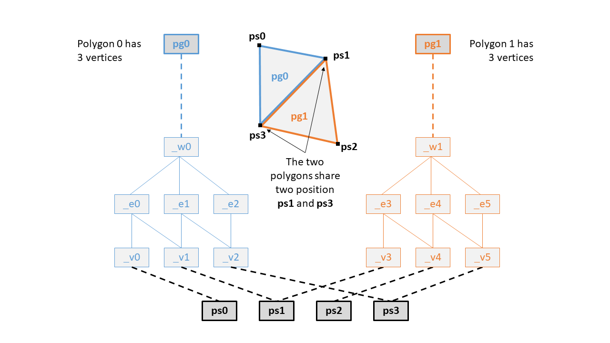
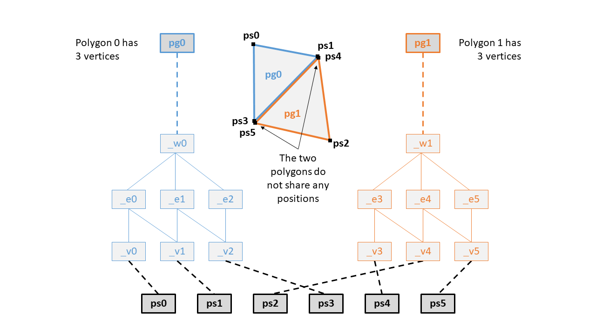

# Topology

Topology is automatically generated from existing user-defined objects. Attributes may be attached to topological components, which may be viewed in the Attribute Table. 

__**Vertex**__

A _vertex_ is a location in space, and can be connected to zero, one, or two edges. 

__**Edge**__

An _edge_ is a line segment joining two vertices in a polyline or polygon.

__**Wire**__

A _wire_ is a multi-segmented line defining a polyline or bounding the surface of a polygon. 

__**Face**__

A _face_ is a surface bounded by a wire.

## Hierarchy

All objects can be broken down into their topological components, which are connected in a hierarchy. The Figures below show two example of the topological hierarchy, for a polyline and a polygon. The polygon also includes a hole. 

## Objects sharing positions

When more than one geometry share the same positions, modifying one geometry would mean modifying the positions for it, and would correspondingly affect all other geometry that share that those positions.

In order to move the geometry separately, you need to unweld it. Unwelding creates a duplicate of the shared positions (by creating new positions at that same location), so that the positions used to define the different geometry are different, even though they are at the same location. 

The following diagrams show the differences between welded and unwelded polylines and polygons:

