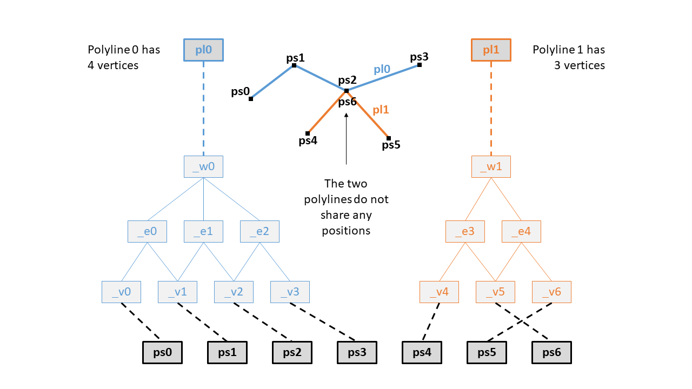

# User-defined Geometry

User-defined geometry is created by explicitly specifying a position or list of positions. 

__**Position**__

A _position_ is an entity that is created at a location in space; while it is not an object, it is the primary unit by which all other geometries are defined. In order to make a point, polyline or polygon, a position(s) has to be created first, before being referenced subsequently. 

__**Point**__

A _point_ is a zero-dimensional object defined at a location as specified by a single position. It is represented in the 3D viewer as a sphere of negligible dimensions.

__**Polyline**__

A _polyline_ is an object defined by a list of at least two positions. The polyline is drawn sequentially based on the order of the positions within the list. 

__**Polygon**__

A _polygon_ is an object defined by a list of at least three positions, comprising a closed wire and a face. The polygon is drawn sequentially based on the order of the positions within the list. 

__**Collection**__

A _collection_ is a list containing any of the above objects; the objects in the list may be of differing types.

## Sharing common positions

When more than one geometry share the same positions, modifying one geometry would mean modifying the positions for it, and would correspondingly affect all other geometry that share that those positions.

In order to move the geometry separately, you need to unweld it. Unwelding creates a duplicate of the shared positions (by creating new positions at that same location), so that the positions used to define the different geometry are different, even though they are at the same location. 

The following diagrams show the differences between welded and unwelded polylines and polygons:

