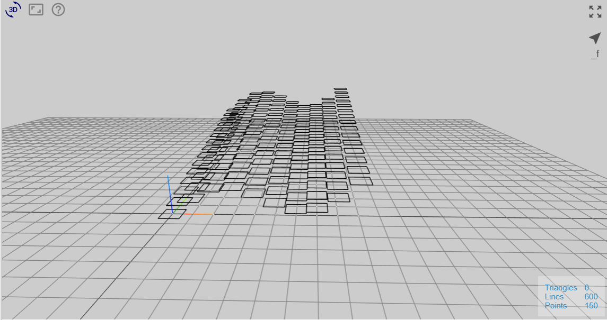

# Example 1

In Example 1, we are going to create a grid of rectangles that are displaced vertically based on their positions in the grid.

## Overview

The generation of the end result may be broken down into a series of smaller steps.

* *Start Node:* Input parameters
* *Node 1:* Create grid of rectangles
* *Node 2a:* Displace each rectangle in z-direction by x- or y- coordinate
* *Node 2b:* Displace each rectangle in z-direction by sine or cosine wave function
* *Node 2c:* Displace each rectangle in z-direction by both x/y-coordinates and sin/cos wave

## File

[Open](https://mobius.design-automation.net/flowchart?file=https://raw.githubusercontent.com/design-automation/mobius-parametric-modeller/master/src/assets/gallery/example_sinewave_wall/Example_1.mob&node=0) the flowchart for Example 1 in Möbius Modeller, or [download](./mob_files/Example_1.mob) it.