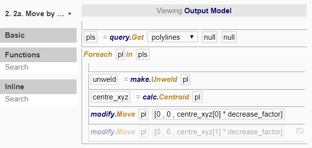

# Node 2a

In this node, we want to move each rectangle upwards depending on its position in the grid. 

*(1) Move by x-coordinate (2) Move by y-coordinate (3) Move by x- and y-coordinate*

To do so, we created the following procedure:

## query.Get

By now, you would have noticed that all the geometry that was created in the previous node is automatically transferred to this one. In order to make use of the polylines created in the previous node, we use the query function. This function is very powerful, as you can filter what is gotten by specifying attribute conditions. 

In order to use the rectangular polylines that we created previously, we need to run a query to get their ids. 

## For-each loop

A for-each loop is a quick way of performing repeated actions without having to do them one by one. Since we are creating a rectangle for each position, putting the steps to create a rectangle from a position in this loop allows us to repeat all the steps in the loop for every single position. 

"For-each *pl* in *pls*" simply means for each item in the list of items, since *pls* is defined as all the polylines previously created, so this translates as "for each polyline in the list of polylines previously created".

## make.Unweld

Visually, the vertices of each rectangle are common between adjacent rectangles. In the model, more specifically, the positions for each rectangle are shared. The implications of this is that when you move a polyline, you move the positions that define it. As a result, moving a rectangle in the middle of the grid will produce the following:

**IMAGE**

In order to separate that rectangle out, make.Unweld creates new positions for each of the shared positions, so that they are no longer shared. Instead, there will be two sets of positions at the same location. 

## calc.Centroid

In order to move the rectangles based on their positions in the grid, we first need a method to determine where the rectangle is in the grid. calc.Centroid gives the xyz-coordinates of the centre of the rectangle, which can be then compared between rectangles.

## Displacement

The modify.Move function moves the geometry by a vector (i.e. [x, y, z]). Since we are moving the rectangles upwards, the value of x and y will be kept as 0. 

* `centre_xyz[0]` returns the x-coordinate of the midpoint of the rectangle
* `centre_xyz[1]` returns the y-coordinate of the midpoint of the rectangle. 

By placing the move function in a for-each loop, the following steps are repeated:

1. Find out how far away the rectangle is from the origin (in x- or y- or both directions)
2. The further away the rectangle it, the greater the displacement

**IMAGE**

In this flowchart, we have multiplied the displacement by *decrease_factor* for better visualisation of the pattern; otherwise, the rectangles are too far apart for the pattern to be distinct. This factor acts to scale the displacement by one-fifth of the original. 

## Disabling lines

Some lines have been disabled in the procedure above. Disabling a line means that it will not be run when the flowchart is executed. There are two modify.Move functions with different distances; to toggle between them, disable one and enable another. 

## Reason for moving the grid

In Node 1, we moved the grid so that the x- and y- coordinates are always positive. This is not crucial or necessary, but it makes the numbers easier to manipulate as we do not have to deal with negative numbers (e.g. range will be 0 to 10 instead of -5 to 5).