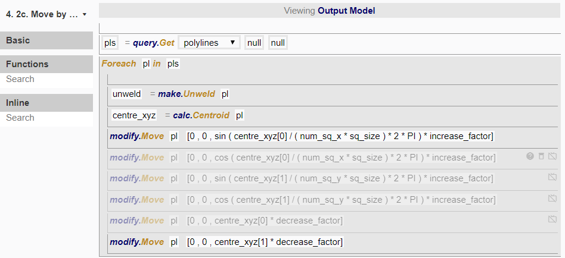

# Node 2c

In this node, we want to move each rectangle upwards depending on its position in the grid, in a way such that it the overall pattern resembles a combination of the results of nodes 2a and 2b. 

*Top: (1) sin(x)+y (2) cos(x)+y (3) sin(x)+x+y (4) cos(x)+x+y*
*Bottom: (5) sin(y)+x (6) cos(y)+x (7) sin(y)+x+y (8) cos(y)+x+y*

To do so, we created the following procedure:

## Combination of values

In the procedure above, we copied and pasted the lines of functions from nodes 2a and 2b to this node. 

Enabling and disabling different combinations of these lines would produce different translations:

However, if we know with certainty what we wish to produce as an end result, instead of having multiple lines of code, we can combine the values. 

For example, if we have the folllowing two lines: 
* `modify.Move( pls[i], [0, 0, a] )` and 
* `modify.Move( pls[i], [0, 0, b] )`, 

We can simply use `modify.Move( pls[i], [0, 0, a+b] )` instead to replace the two lines of code. 