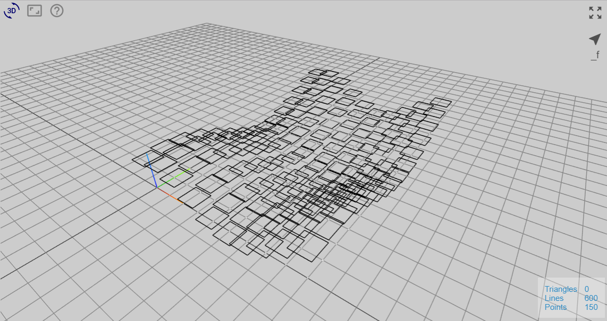

# Example 2

In Example 2, we are going to parameterise the wave function for the displacement of the rectangles that we created in Example 1.

## Overview

The generation of the end result may be broken down into a series of smaller steps.

**FLOWCHART GIF**

* *Start Node:* Input parameters
* *Node 1:* Create grid of positions (from Example 1)
* *Node 2:* For each position, create a closed rectangular polyline around it (from Example 1)
* *Creation of function from flowchart*: Flowchart to return displaced sin/cos wave; can be imported as user-defined function
* *Node 3a:* Displace each rectangle in z-direction by sine or cosine wave function (using imported function)
* *Node 3b:* Displace each rectangle in z-direction by sin + cos wave (using imported function)

## File

Click [here](https://design-automation.github.io/mobius-parametric-modeller/) to open the flowchart for Example 2 in Möbius Parametric Modeller.