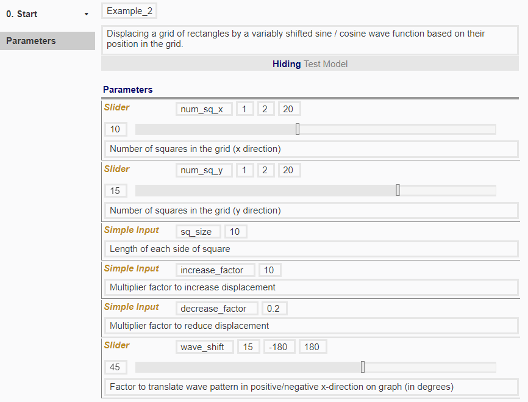

# 'Start' Node

## Input parameters

We will maintain the two sliders and one simple input for variables *num_sq_x*, *num_sq_y*, *sq_size*, *increase_factor* and *decrease_factor* from Example 1.

In Example 1, we used the sin and cos functions to create the corresponding wave patterns through displacement. In Example 2, we want to be able to translate the wave graph through an additional variable *wave_shift*. 

**IMAGE**

## Creating input parameters

We will add a new slider with variable name *wave_shift*, with the range -180 to 180 (degrees to shift it by; -180 to 180 suffice to reproduce a full translation of the wave).

For now, input the values as shown below. 

