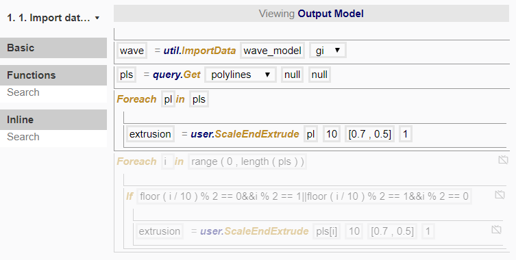

# Node 1

In this node, we want to 

To do so, we created the following procedure:

## Checkerboard pattern

In order to create an alternating checkerboard pattern for the extrusion, we disable the first foreach loop and enable the second. 

## Foreach loop

Here, we are using a slightly different input for the arguments in the foreach loop. Instead of `Foreach pl in pls`, we use `Foreach i in range(0,length(pls))`. Let's break this down further.

The inline function of length(list) gives the length of a list. So `length(pls)` gives the length of the list, also known as the number of polylines in the list. 

The inline function of range(min,max) creates a list of numbers from min to max. So `range(0,length(pls))` creates a list of numbers starting from zero, and the number of numbers in this list is equal to the number of polylines. 

As a result, *pls[0]* gives the first polyline, *pls[1]* gives the second polyline and so on, till *pls[number of polylines -1]* gives the last polyline. In order to refer to each of the polyline, we use `pls[i]`, where `i` will be equal to 0, 1, 2, 3,...number of polylines-1. 

## Logic 

Here we do not want to create extrusions for all the polylines, but rather only do so in a checkerboard pattern. Accordingly, we need to choose which polylines to extrude, and we can do so by creating a condition based on their index *i*. 

*i* = 0 for the first polyline;
*i* = 1 for the second polyline;
*i* = 2 for the third polyline;...

If we use `i%2==0`, the '%' sign is the modulo function, which roughly translates to "the remainder after dividing". So, `If i%2==0` means "if the remainder of *i* divided by 2 has a value equal to 0". 

Setting this as the condition would return the values of *i* = 0, 2, 4, 6,... which are all even numbers. 

Setting the condition as `If i%2==1` gives values of *i* = 1, 3, 5, 7,... which are all odd numbers. 

By using `If floor(i/10)%2==0`, floor(i/10) would mean rounding down the result to the nearest integer for i/10. (For example, when *i*=12, i/10 = 1.2 and rounding that down by using the floor function would give 1.)

* *i*= 0, 1, 2, 3, 4, 5, 6, 7, 8, 9 would give `floor(i/10)`=0;
* *i*= 10, 11, 12, 13, 14, 15, 16, 17, 18, 19 would give `floor(i/10)`=1;
* *i*= 20, 21, 22, 23, 24, 25, 26, 27, 28, 29 would give `floor(i/10)`=2; and so on.

So `If floor(i/10)%2==0` would return *i* = 0-9, 20-29, and so on. 

If we want to combine both alternating sequences for rows and columns, we need to use the operator '&&'. `If A = true &&B = true` means both A **and** B has to be true. If we only need either condition to be true, we will use `If A = true || B = true`, where '||' means **or**. 

Combining both the **and** and the **or** conditions, we get:
`floor ( i / 10 ) % 2 == 0&&i % 2 == 1||floor ( i / 10 ) % 2 == 1&&i % 2 == 0`

which in simple language means:
if "remainder of (*i* divided by 10) divided by 2 is 0 AND remainder of *i* divided by 2 is 1" OR if "remainder of (*i* divided by 10) divided by 2 is 1 AND remainder of *i* divided by 2 is 0"

This condition gives the final result of the checkerboard pattern. 

