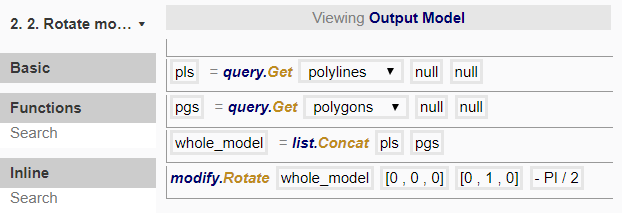

# Node 2

In this node, we want to rotate the model from lying on the horizontal plane to a vertical plane, such that it would resemble a wall with extrusions and apertures.

To do so, we created the following procedure:

First, we get the polylines and polygons in the model (i.e. all the geometry in the model, since these are the only two that we have created so far) using the query.Get function. Each query gives us a list of IDs. 

Next, we combine the list of IDs into a single list by list.Concat, which is short for concatenate. This creates a single list with all the IDs of both polylines and polygons.

Lastly, we rotate all these geometry by the y-axis around the origin by -PI/2 (or -90 degrees). 